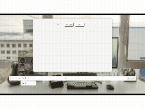

# 📝 To-Do List Web App

This is a simple and elegant **To-Do List** web application built using **HTML**, **CSS**, **Bootstrap**, and **jQuery**. It allows users to manage their daily tasks with a responsive and user-friendly interface.

---


## 🌐 Live Demo

🔗 [https://seffysnow.github.io/To-Do-list.github.io](https://seffysnow.github.io/To-Do-list.github.io)

---

## ✅ Features

- **Add New Tasks**  
  Input your task and click the ➕ icon to add it to your list.

- **Edit Existing Tasks**  
  Click “edit” on any task to modify its content via a popup modal.

- **Mark Tasks as Completed**  
  Click the icon to toggle a task’s status between “done” and “undone.”

- **Remove Tasks**  
  Instantly delete any task using the “remove” option.

- **Filter Tasks**  
  Use the **All / Completed / Active** buttons to view tasks by status.

- **Responsive Design**  
  Works well across desktops, tablets, and mobile devices.

---

## 💡 Why This Interested Me
I wanted task management to feel **less effortful** and more conversational. This project let me demonstrate practical **problem-solving** with real UX constraints (voice input, local-time date parsing, error handling) and show **LLM + agentic** integration in a way that's actually useful.

---

## 🧰 Technologies
- **Frontend:** HTML, CSS, Bootstrap, JavaScript (jQuery), Web Speech API
- **AI & Logic:** LLM for intent/date extraction, lightweight agent to execute intents
- **Date parsing:** chrono-node (natural language → dates, normalized to `YYYY-MM-DD`)
- **Backend:** Node.js, Express (as a proxy to keep API keys secret), node-fetch

## 🎥 Demo



---

## 📁 Project Structure

```plaintext
📦 To-Do-list.github.io/
├── index.html           # Main HTML structure
├── new.css              # Custom styling
├── bootstrap.min.css    # Bootstrap v3.3.7 (local)
└── js/
    └── jquery-3.6.1.min.js
